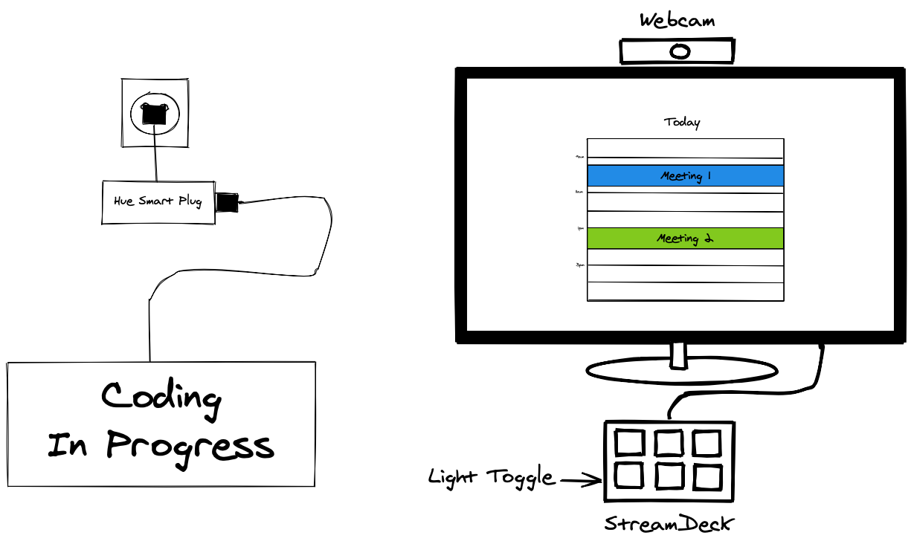

# Building a Meeting Light

Working at home is great and I'm all in (just got hired at a remote position), but there is one common pitfall of working at home that me and my girlfriend constantly bumped up against: knowing if I'm in a meeting.
To solve this problem my girlfriend bought me a light that says "Coding in Progress".
This solves the problem of having an "at a glance" way to tell that I'm in a meeting, but the process for turning on the light was manual, which would inevitably lead to the lights state being wrong.

Instead of being vigilant about the lights state, I chose the path I often choose: be as lazy as possible.

This post will walk you through the experience I had while implementing this idea. If you want to do any of this yourself you need to make sure that your setup allows for it, and that you have the necessary hardware.

**Prerequisites:**

- All of your meetings are stored in you Apple Calendar
- You're on a mac (could work on windows but much of the steps will be different)

**Required Materials:**

1. 1 Dumb Light
1. Smart home light setup (I use Phillips Hue)
1. 1 smart plugin that interfaces with your smart lights
1. StreamDeck (Optional)



## Use Cases

For this to have a good user experience it had to meet a few different use cases:

1. Turn light on in a meeting
1. Turn light on in an impromptu meeting
1. Manually turning on the light (for when I'm actually coding and don't want to be disturbed)

### In a Meeting

I've wanted to build a meeting light for awhile, but at my old job we used a calendar that couldn't be easily synced to Apple Calendar.
At my new job we use Google Calendar, it is has great support within Apple's Calendar, so I could actually attempt to build this!

It is apparently obvious how you would go about getting all of the events out of your calendar and I went down many rabbit holes trying to find a way.

#### Hole #1: [Fantastical](https://flexibits.com/fantastical) Notifications

Something you may not know about your mac is that all of the notifications are stored in sqlite databases on your computer.
In the past I used this to [win Coachella tickets](https://github.com/hipstersmoothie/coachellaTickets) from radio station by analyzing [Shazam](https://www.shazam.com) notifications.

While my previous endeavor into mac system notification storage had been fruitful, this time around it wasn't.
What I found was encrypted, so this path was not feasible.
(Or maybe it is, IDK!)

#### Hole #2: [AppleScript](https://developer.apple.com/library/archive/documentation/AppleScript/Conceptual/AppleScriptLangGuide/introduction/ASLR_intro.html) to List Events

While investigating how to extract my meeting information out of Fantastical I found they had an AppleScript API!
If you don't know what AppleScript is here's a definition:

> AppleScript is a scripting language created by Apple Inc. that facilitates automated control over scriptable Mac applications.

With Fantastical's AppleScript API you can add events to Fantastical just like you would from the application.
Unfortunately they have no API for listing events in a calendar, so I hit another dead end.

In my digging I found that you _could_ get the native Apple Calendar to list out the days events.
I hooked up my google calendar and was eventually able to get a tiny script to list out the days events!

...but then I noticed something, there were no repeating events 💔

A fairly large amount of my meetings are recurring meetings so I set off to find out how to get my AppleScript to list recurring events.
This lead me to forums with posts from ~12 years ago and a [~2000 line AppleScript](https://macscripter.net/viewtopic.php?id=29516) that I was scared to even load into the repl.
When I tried to execute the program it failed, likely because of something in the code no longer being valid.
While I consider myself a good programmer I wasn't interested in debugging this huge script so I set out looking for another solution.

#### Solution: `icalbuddy`

Turns out other people wanted to solve this problem and even made a tool for it! 🎉

Meet [`icalbuddy`](https://github.com/ali-rantakari/icalBuddy), a CLI to get calendar events with support for recurring events.
I installed it and tried to run it but the main fork was built only for 32 bit architecture macs, so I was greeted with an error message.
Luckily the community built a 64 bit version, which after I installed actually worked!

After fiddling around with the CLI I found the following command listed the events and information I wanted:

```shell
icalBuddy \
  # List only event on my work calendar
  -ic andrew@email.com  \
  # No calendar names
  -nc \
  # No relative dates
  -nrd  \
  # Exclude all-day events
  -ea \
  # Exclude attendees
  -eep attendees \
  # Print events occurring today
  eventsToday
  ]);
```

With this in hand I was able to write a little bit of code to parse the meetings into the following objects, then find if I'm currently in a meeting.

```ts
interface Meeting {
  title: string;
  meetingUrl?: string;
  startTime: string;
  endTime: string;
  notes: string;
}
```

### Using the Camera

While most of the time I'm in a meeting there is a calendar events, sometimes I take a meeting of the fly.
In these cases the code needs to detect that my camera is in use.

Figuring out how to do this was a little bit harder, there isn't any API (that I know of) to easily determine if any of my webcams are in use, but I found a post on stackoverflow that helped.

Running the following command will list out any processes on my computer that are using the camera. In that output I saw `zoom.us` and `Facetime`.

```shell
lsof | grep VDC
```

Unfortunately after some testing I realized it wasn't quite working as intended.
These application were accessing my camera but the camera wasn't actually on, the apps were just open.
After a little google I found a [Sindre Sorhus package `is-camera-on`](https://github.com/sindresorhus/node-is-camera-on) to do the job.
With this package I could easily test whether the camara on my mac was actually in use!

But again after a little testing I found this didn't work for my external USB camera I use at my desk 💔 So I whipped out the command from above to see if there was another process I could key off for my external camera use.

After staring at the output for a little while longer I noticed the `caphost` process was only ever on if my camera was on!
Combining `is-camera-on` with code looking for the `caphost` seemed to do the trick.

## Controlling the Light

Now that I had all the parts I needed to detect if I wanted the camera on I could finally start coding the logic to actually turn the light off and on!

I did a search on npm for the simplest Phillips Hue integration library and found [`huejay`](https://www.npmjs.com/package/huejay).
This was super simple to set up and after only a few minutes I had code to toggle my light.

```ts
// @ts-ignore
import huejay from "huejay";

const TARGET_LIGHT = "Meeting in progress";

/** Set the lights state. Or omit the state to toggle it */
export async function changeLightState(state?: "on" | "off") {
  const [bridge] = await huejay.discover();
  const client = new huejay.Client({
    host: bridge.ip,
    username: "SECRET",
  });

  const lights = await client.lights.getAll();
  const light = lights.find((l: any) => l.name === TARGET_LIGHT);

  light.on = typeof state === "undefined" ? !light.on : state === "on";
  await client.lights.save(light);
}
```

I never actually want to run this code myself though.
It should be ran in certain situation by other methods on my machine.

### With a `cron` Job

This is where the automation actually happens.
With all of the above code I now had a `determineLightState` function that I could call to determine if the lights should be on or off, then apply that state to my hue light.

Instead of spinning up a server that checked the state at regular intervals I decided to lean into the tool built into my computer and define a [cron job](https://en.wikipedia.org/wiki/Cron).

I run my code every fifteen minutes to determine the lights state.
My meetings generally start on these marks.
This isn't 100% accurate (I could get out a meeting early), but I'm not too concerned with that.
If this doesn't work for me I can always up how often the script runs to get more real-times results.

```cron
0,15,30,45 * * * * ts-node --project ~/Documents/meeting-light/tsconfig.json ~/Documents/meeting-light/determine-light-state.ts
```

### With [StreamDeck](https://www.elgato.com/en/stream-deck)

With the light fully automated now there was just one use case left to cover: turning the light on with my StreamDeck.

This part was by far the easiest since there was an officially supported plugin available for install.
I set it to toggle my smart plug and I was done!

## Making the two control methods play well together

...or so I thought.
In talking to my girlfriend I figured out there was an edge case in my design.
Sometimes I might want to turn on the sign when I'm coding and not in a meeting.

With the current setup the following could happen:

- I turn on the light manually with my StreamDeck
- The cron job runs, determines I'm not in a meeting or using my camera, and shuts of the light when I want it on!

So down more rabbit holes we go!

My plan: write a file to the system when I manually turn the light on. This way my other code can exit early if the file exists.

#### Hole #1: Editing the Hue Plugin

My first thought was to just edit the official hue plugin to write a file to my system.
I quickly found out though that the hue plugin is written in JS/HTML with no access to the file-system.

#### Hole #2: Writing my own Hue Plugin

I learned there are two ways to write a StreamDeck plugin:

1. JS/HTML
2. Compiled binary from any language

To accomplish this I would have to write my own plugin from scratch.
That's something I didn't want to do at all so I quickly correct course.

#### Solution Web Sockets

In poking around the code of the hue plugin and reading up about all the publicly available solution for solving this problem I noticed web sockets being used a lot.
While up until now I had been able to avoid running a server, this is where that stopped.

Taking inspiration from [`streamdeck-util`](https://www.npmjs.com/package/streamdeck-util) I wrote this little web socket server.

```js
const WebSocket = require("ws");
const fs = require("fs");
const path = require("path");

const TOGGLE_FILE = path.join(__dirname, "is-on");
const wss = new WebSocket.Server({ port: 1337 });

wss.on("connection", (ws) => {
  ws.on("message", (state) => {
    try {
      if (state === "true") {
        fs.writeFileSync(TOGGLE_FILE, "");
      } else {
        fs.unlinkSync(TOGGLE_FILE);
      }
    } catch (error) {}
  });
});
```

and added this code to the hue StreamDeck plugin installed on my system in `powerAction.js`:

```js
try {
  const connection = new WebSocket("ws://localhost:1337");

  connection.onopen = () => {
    connection.send(JSON.stringify(targetState));
    connection.close();
  };
} catch (error) {}
```

Now whenever the toggle light button is pressed on my StreamDeck it writes a `is-on` file to my code's directory if the lights on, and removed it if it isn't. 🎉

The last step was to run this web socket server whenever my computer is on so I added this `plist` to my `LaunchDeamons`:

```xml
<?xml version="1.0" encoding="UTF-8"?>
<!DOCTYPE plist PUBLIC "-//Apple//DTD PLIST 1.0//EN" "http://www.apple.com/DTDs/PropertyList-1.0.dtd">
<plist version="1.0">
<dict>
<key>Label</key>
<string>www.meeting-light.application</string>

<key>WorkingDirectory</key>
<string>/Users/andrewlisowski/Documents/meeting-light</string>

<key>ProgramArguments</key>
<array>
<string>/usr/local/bin/node</string>
<string>on-server.js</string>
</array>

<key>RunAtLoad</key>
<true/>

<key>KeepAlive</key>
<true/>

</dict>
</plist>
```

All this little bit of `xml` does is start the web socket server on computer startup.

---

With that I now have an automated meeting light with a great user experience!
I hope you enjoyed going on this adventure with me.

If you want to set this up yourself [take a look at my code]().

If you want more from me, or even just to say hi, [follow me on twitter](https://twitter.com/HipsterSmoothie).
